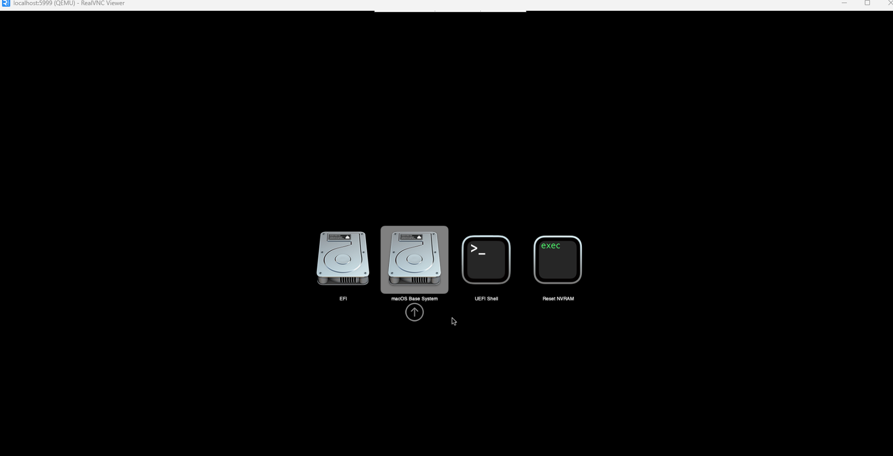

# Tauri template

Template uses typescript with vanilla flavour for UI.

## Recommended IDE Setup

- [VS Code](https://code.visualstudio.com/) + [Tauri](https://marketplace.visualstudio.com/items?itemName=tauri-apps.tauri-vscode) + [rust-analyzer](https://marketplace.visualstudio.com/items?itemName=rust-lang.rust-analyzer)

## Prerequisites

### Tauri

See tauri [prerequisites](https://v2.tauri.app/start/prerequisites/).

*Note*: you required to install [node.js](https://nodejs.org/en). After that you need to run:

```bash
cd ./tauri-template-app
npm install
cd ..
```

This will install all required node dependencies which is required step before you build your app.

### Cargo plugin

This plugin required to build project.

```bash
cargo install tauri-cli --version "^2.0.0" --locked
```

### Android

Download and install Android Studio from official [website](https://developer.android.com/studio).

Then [configure](https://v2.tauri.app/start/prerequisites/#android) environment for Tauri and Android Studio.

### IOS

Run this script root directory(.) to install minimal required dependencies

```bash
./install_mac_dep.sh
```

## Run project

Run this command from project root(`./tauri-template-app`)

```bash
cargo tauri dev 
```

## You don't have macOS to develop on IOS?

You can run macOS from Linux or Windows using `Docker-OSX`.

### How to start on Windows:

Ensure that you have Windows 11 installed.

Install [WSL](https://learn.microsoft.com/en-us/windows/wsl/) if you have not done it before. Run these commands from cmd
```bash
wsl --install
wsl --update
```

Then set up WSL distro by default:
```bash
# For example, 'wsl -d Ubuntu'
wsl -s <DistroName>

# Ensure that you have installed Linux distro by default
```

After WSL installation go to `C:/Users/Your_Name/.wslconfig` (Create if it doesn't exist) and add `nestedVirtualization=true` to the end of file. The result should be like this:
```bash
[wsl2]
nestedVirtualization=true
``` 

Run WSL
```bash
wsl
```


Install `cpu-checker` and then run `kvm-ok` to ensure that you can use kvm
```bash
# installing cpu-checker to be able run 'kvm-ok' command
sudo apt install cpu-checker

# Ensure that we can use kvm
kvm-ok
```

Your output should be like this:
```bash
INFO: /dev/kvm exists
KVM acceleration can be used
```

Now you can leave WSL using `Ctrl + D ` or via command `exit`. And now it is time to install [Docker Desktop](https://docs.docker.com/desktop/setup/install/windows-install/) if you have not done it before.

After installation, go to Settings and check these 2 boxes:

```bash
General -> "Use the WSL2 based engine"
Resources -> WSL Integration -> "Enable integration with my default WSL distro"
```

Okay, finally you can run docker-osx, just run this script:
```bash
wsl -e ./install-windows-macos.sh

# You can set RAM or CPU using '-e' flag for greater perfomance, by default they are: RAM=6, CPU=Haswell-noTSX

# Example `wsl -e ./install-windows-macos.sh -e RAM=10` 
```

You have to wait a little bit and after installation your command line will be like this: 


Then type `Enter` and you will be in (qemu) mode:


Type command
```bash
change vnc password <your password>
```


Don't type a strong password, it's not super important

Now, install [RealVNC Viewer](https://www.realvnc.com/en/connect/download/viewer/windows/) if you have not done it before. Open it and enter `localhost:5999`


Then enter passwrod which you set before.

After you will have this:



Enter `macOS Base System` -> Enter `Disk Utility` -> Choose the bigest one -> Click on `Erase` -> Enter name of your disk and continue.

Go back and click on `Reinstall macOS Sonoma`

After you agree with all therms, chose erased disk and wait untill macOS installed. It is going to take about 2 hours.

Congratulations you have just run macOS on Windows!

## How to start installed container?

Just run this command:
```bash
wsl -e docker start -i -a <DOCKER_ID>

# Example: 'wsl -e docker start -i -a b91f2377d848ba46e7a7e97c8bf02734c9775af36fd94da26fd70054083b8e50' 
```

### How to start on Linux:

[Try this official Docker-OSX guide](https://github.com/sickcodes/Docker-OSX?tab=readme-ov-file#quick-start-docker-osx)

Good luck!